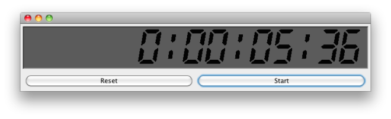

AKDigitalPane
=============
###### ~:( A LED-like Customizable Display for your JAVA Application ):~


### What is this?
When I was trying to code my first calculator in java, I was wondering if I can display the textfield like a real calculator display! I have no answer that time. But later on, I realized, I can! And so I tried and came up with this!

It is an extended JPanel named AKDisplayPane which displays any text like a LED-type display. You can use it like a normal JPanel or JTextField without bothering how it works. (And of course, you can know how it works, if you want – as it is opensource.)

Look at this: ( Isn’t it nice :] )



### Features:

* Set text simply with a method `setText(String text)`.
* Set different **font-size**.
* Set different **foreground** and **background color**.
* Set it **italic** (use an *angle* in degree, how much it will bend to left/right).
* … and of course everything else you can customize as a JPanel!

### Where to start:

1. **Download example-project from github.**<br/>
The project includes two class file `AKDigit.java` and `AKDisplayPane.java` within package `com.ashkit.digital`
(And an example class `TesterFrame.java`, where I've created a stopwatch using AKDisplayPane which is shown in screenshot).
2. **Copy source to your project**<br/><br/>
<br/><br/>
Copy `AKDigit.java` and `AKDisplayPane.java` in a path `com\ashkit\digital` in your project.
(Or you can just copy `com`-folder from the example to your project-root)
3. **.. and instantiate a AKDisplayPane in Your Code like this:**<br/>

``` java
// Constructor: AKDisplayPane(int noOfDigits, float size)
AKDisplayPane p = new AKDisplayPane(15, 2.0f);
 
// set your text
p.setText(“12:45 AM”);
 
// you can customize to make it more like your's
p.setItalic(-10);
p.setFontColor(Color.BLACK.brighter());
 
// you can use customization as a JPanel
p.setBackground(Color.DARK_GRAY.brighter());
p.setBorder(new BevelBorder(BevelBorder.LOWERED, null, null, null, null));
```

<br/>
## Reference : AKDisplayPane

#### Constructors:
``` java
public AKDisplayPane(int noOfDigits, float thick)
public AKDisplayPane(int noOfDigits, float thick, float gap)
```

#### Public Methods:
``` java
public String getText()
public void setText(String text)
public void setFontColor(Color c)
public void setFontParams(float thick, float gap)
public void setItalic(int degree)
```